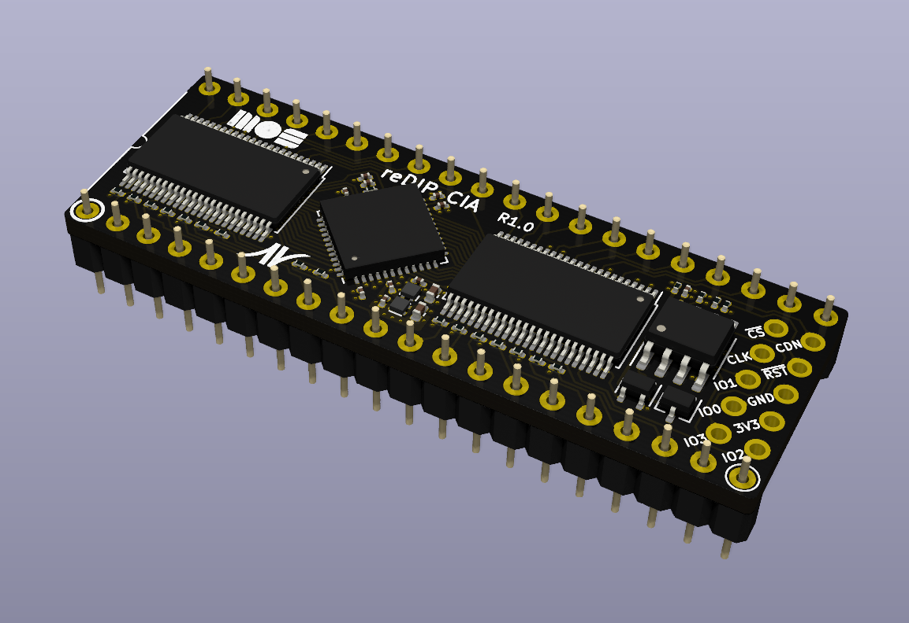

# reDIP CIA

## MOS 6520 PIA / MOS 6522 VIA / MOS 6526/8520/8521 CIA FPGA replacement

## Overview
The reDIP CIA is an open source FPGA board which combines the following in a DIP-40 size package:

* Lattice iCE5LP1K FPGA
* 1Mbit FLASH
* 5V tolerant I/O

The reDIP CIA provides an open source hardware platform for MOS 6520 PIA / MOS 6522 VIA / MOS 6526/8520/8521 CIA replacements.

Designs for the iCE5LP1K FPGA can be processed by [yosys](https://github.com/YosysHQ/yosys/) and [nextpnr](https://github.com/YosysHQ/nextpnr/).

## I/O interfaces

### DIP-40 header pins:

* 5V input
* 35 FPGA GPIO
* 3 FPGA open-drain I/O
* GND

All FPGA header I/O is 5V tolerant, and can drive 5V TTL.

### SPI / programming header:

A separate header footprint is provided for (Q)SPI flash programming, with pinout borrowed from the [iCEBreaker Bitsy](https://github.com/icebreaker-fpga/icebreaker).

## MOS 6526/8521 CIA compatibility

The board is fully pin compatible with the venerable MOS 6526/8521 CIA chips.

Cycle accurate emulation of the MOS 8521 chip has been implemented in [gateware](gateware/).

## Thanks

The gateware implementation would not have been possible without the [outstanding work](http://forum.6502.org/viewtopic.php?f=4&t=7418)
on the MOS 8521 chip by Frank "androSID" Wolf and Dieter "ttlworks" Müller.
