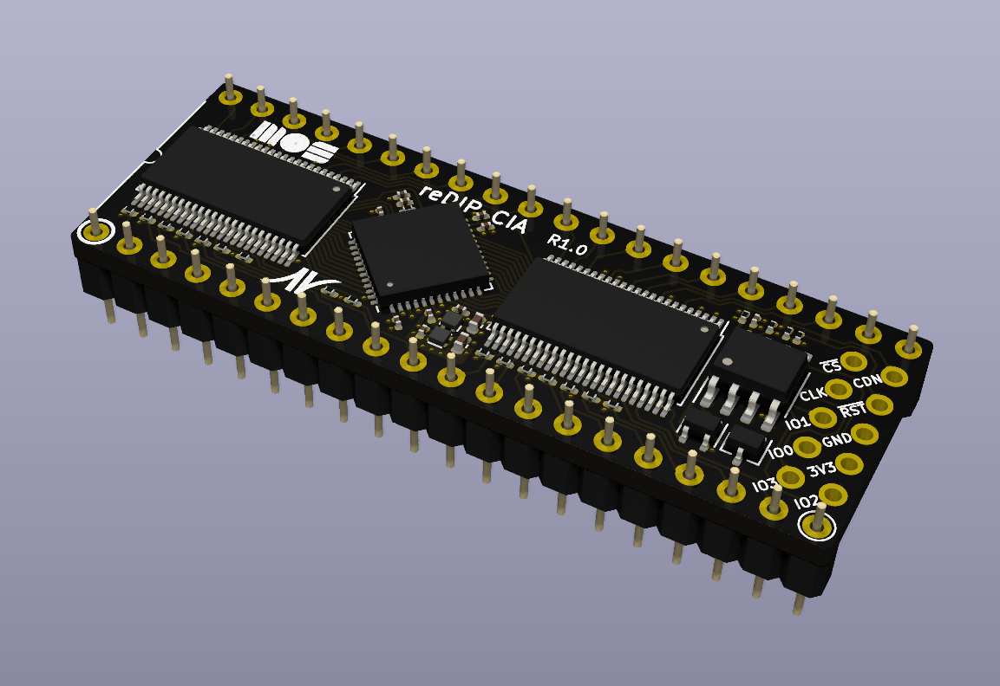

# reDIP CIA

## MOS 6520 PIA / MOS 6522 VIA / MOS 6526/8520/8521 CIA FPGA replacement

## Overview
The reDIP CIA is an open source FPGA board which combines the following in a
DIP-40 size package:

* Lattice iCE5LP1K FPGA
* 1Mbit FLASH
* 5V tolerant I/O

The reDIP CIA provides an open source hardware platform for MOS 6520 PIA /
MOS 6522 VIA / MOS 6526/8520/8521 CIA replacements.

Designs for the iCE5LP1K FPGA can be processed by
[yosys](https://github.com/YosysHQ/yosys/) and
[nextpnr](https://github.com/YosysHQ/nextpnr/).

## I/O interfaces

### DIP-40 header pins:

* 5V input
* 35 FPGA GPIO
* 3 FPGA open-drain I/O
* GND

All FPGA header I/O is 5V tolerant, and can drive 5V TTL.

### SPI / programming header:

A separate header footprint is provided for (Q)SPI flash programming, with
pinout borrowed from the
[iCEBreaker Bitsy](https://codeberg.org/icebreaker-fpga/icebreaker).

## MOS 6526/8521 and MOS 8520 CIA compatibility

The board is fully pin compatible with the venerable MOS 6526/8521 and MOS 8520
CIA chips.

Cycle accurate emulation of the MOS 6526/8521 and MOS 8520 CIA chips has been
implemented in [gateware](gateware/CIA/), configurable via [software](software/).

## MOS 6522 VIA compatibility

Cycle accurate emulation of the MOS 6522 VIA chip has been implemented in
[gateware](gateware/VIA/). Please note that this is currently completely
untested!

## Thanks

The gateware implementations would not have been possible without the
[outstanding work](https://6502.org/forum/viewtopic.php?t=7427) on varius MOS
chips by Frank "androSID" Wolf and Dieter "ttlworks" Müller.
