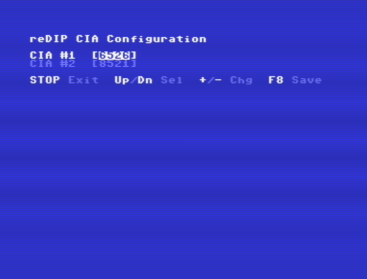

# reDIP CIA software

## CIA model configuration

The supplied [C64 program](cia-config.prg) can be used to select between MOS6526 and MOS8521 emulation for reDIP CIA boards in C64 and C128 machines.

The configuration is stored in the on-board flash chips.

The detected chip model is also displayed for original CIA chips.
